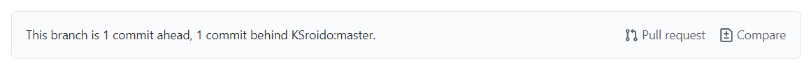
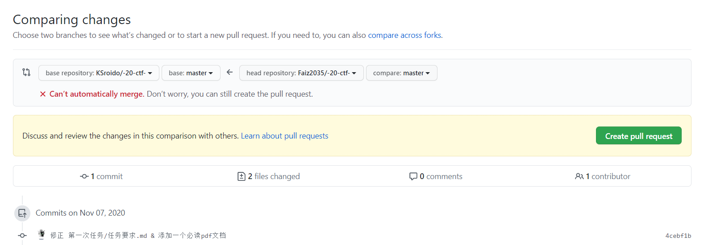
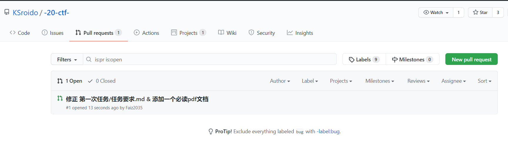

### 起因
发现自己对github如何对别人的仓库发起pr不熟，写个md记录一下（丢人。

### 正文
首先得fork别人的仓库，也就将原仓库克隆一份，变成自己可以自由提交的仓库。再将自己克隆的那份仓库clone下来。
```sh
$ git clone https://github.com/Faiz2035/UJS-20-CTF.git
```
```sh
$ git log 
commit adecc23032936ef2c8519560d9e440954a94833c (HEAD -> master, origin/master, origin/HEAD)
Merge: 4cebf1b 0f44c1d
Author: 冷罗KS <68413810+KSroido@users.noreply.github.com>
Date:   Sat Nov 7 19:19:38 2020 +0800

    Merge branch 'master' into master

commit 4cebf1be5cfce37d8a0f4de46f2923eb465321f7
Author: faiz2035 <1315509437@qq.com>
Date:   Sat Nov 7 18:17:51 2020 +0800

    修正 第一次任务/任务要求.md & 添加一个必读pdf文档
```
commit是什么？git是一个版本控制工具，每个commit就是一个变动的版本。[What is exactly meaning of commit command in git
](https://stackoverflow.com/questions/43970559/what-is-exactly-meaning-of-commit-command-in-git)

如果用指针来描述就是，`HEAD` 就是一个指针，指向的`commit`就是当前本地仓库所处的状态。`orgin` 用来指代当前本地仓库的源头，现在我`clone`的是`github.com/Faiz2035/UJS-20-CTF`仓库，那它就指代这个仓库。

`HEAD -> master` 即说明当前所在的分支为master分支。
`origin/master` 指的是origin仓库的master分支此时也指向这个commmit。 
`origin/HEAD` 指的是origin仓库的所处的commit。

此时，当我在本地仓库添加了这篇文章之后。
```sh
$ tree .
.
├── consist_input_behavior.cpp
├── DecToBin.py
├── README.md
├── regex.cpp
└── 第一次任务
    ├── Faiz2035
    │   └── github协作小试.md
    ├── 任务要求.md
    └── 扫盲 Linux＆UNIX 命令行 — — 从“电传打字机”聊到“shell 脚本编程”.pdf
$ git status
On branch master
Your branch is up to date with 'origin/master'.

Untracked files:
  (use "git add <file>..." to include in what will be committed)
        "\347\254\254\344\270\200\346\254\241\344\273\273\345\212\241/Faiz2035/"

nothing added to commit but untracked files present (use "git add" to track)
```
通过git status查看当前这个本地仓库所处的状态，可以看得它提示我存在
`Untracked files`，也就是现在仓库发生修改，但是尚未进行跟踪。
此时需要执行 git add 命令才会使得git将修改添加进暂存区。告诉Git希望在下一次commit中包含对特定文件的更新。
```
$ git add *
```
`*` 表示将所有修改的文件添加进暂存区，如果是特定文件需指定文件名。接下来调用`git commit`命令提交修改。
```sh
$ git commit -m "提交第一篇学习报告(faiz2035)"
[master 15393c3] 提交第一篇学习报告(faiz2035)
 1 file changed, 71 insertions(+)
 create mode 100644 "\347\254\254\344\270\200\346\254\241\344\273\273\345\212\241/Faiz2035/github\345\215\217\344\275\234\345\260\217\350\257\225.md"
```
`-m` 参数 表示此次commit所附加的消息，用简短的语句来描述进行了怎样的修改。
一般如果进行的改动很多，还会提交一个changelog。
```
$ git log
commit 15393c3f08722ba03b0d88ed5fe9fe1f672ca58b (HEAD -> master)
Author: faiz2035 <1315509437@qq.com>
Date:   Sun Nov 8 14:20:15 2020 +0800

    提交第一篇学习报告(faiz2035)

commit adecc23032936ef2c8519560d9e440954a94833c (origin/master, origin/HEAD)
Merge: 4cebf1b 0f44c1d
Author: 冷罗KS <68413810+KSroido@users.noreply.github.com>
Date:   Sat Nov 7 19:19:38 2020 +0800

    Merge branch 'master' into master
```
可以很明显看得HEAD指针指向的版本要比origin仓库的版本要新。
如果想要将本地仓库的修改提交到origin仓库。
```sh
git push origin master
```
这条命令即是将本地仓库的修改提交到origin仓库的master分支。此时再调用`git log`命令即可看得origin仓库master分支的head指针与本地仓库master分支的head指针又再次指向了同一版本。

以上所有的修改都只是在自己的仓库中进行修改，如何将自己仓库的修改提交到别人的仓库呢。

在GitHub上打开自己的仓库，它会提示你的版本与你fork的仓库不同了，是否发起pull request。

点击compare查看你的仓库与别人的仓库直接有什么不同，点击`Pull request`即可发起`pull request`请求。

点击大大的绿色按钮即可。然后就可以在对方仓库的pr列表中看得你的pr请求，等待对方处理即可。


